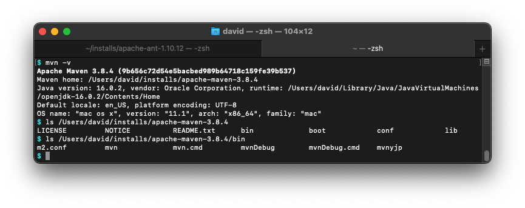

# Instructions
### David Maciulis 1508366

# Ant+Ivy [40 pts]
- [5 pts] A screen capture showing the version of Ant that you installed and its install directory.

- [5 pts] A screen capture showing the output generated by the `ant go-nodeps` execution during the Ivy installation.

- [15 pts] A screen capture showing a successful build using the Ant+Ivy script.

- [5 pts] A screen capture showing a successful execution of the JAR file created from the Ant+Ivy build.

- [10 pts] Links to the complete and correct [hello-world/build.xml](hello-world/build.xml) and [hello-world/ivy.xml](hello-world/ivy.xml) files.

# Maven [30 pts]
- [5 pts] A screen capture showing the version of Maven that you installed and its install directory.

- [10 pts] A screen capture showing a successful build using the Maven script.

- [5 pts] A screen capture showing a successful execution of the JAR file created from the Maven build.

- [10 pts] Links to the complete and correct [hello-world/pom.xml](hello-world/pom.xml) file.

# Gradle [30 pts]
- [5 pts]A screen capture showing the version of Gradle that you installed and its install directory.

- [10 pts] A screen capture showing a successful build using the Gradle script.

- [5 pts] A screen capture showing a successful execution of the JAR file created from the Gradle build.

- [10 pts] Links to the complete and correct [hello-world/build.gradle](hello-world/build.gradle) file.